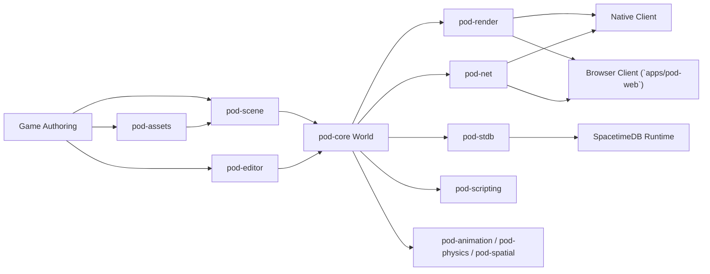

# Architecture Overview

This document describes the current Prompt or Die platform architecture as it exists in the workspace today. It is intentionally grounded in the current crate layout and runtime behavior rather than the full long-term roadmap.

## Design goals

- One runtime for humans and AI agents
- Deterministic simulation first
- Native and browser clients from the same core world model
- Authoring surfaces for 2D, 2.5D, and 3D games
- Server-authoritative multiplayer with a path to SpacetimeDB-native worlds

## System map

## Core runtime

`pod-core` is the authoritative simulation kernel. It defines:

- ECS components and entity state
- The shared `Agent` trait and agent slots
- Action validation and constraint enforcement
- Observation building
- The tick loop and event bus
- Deterministic timing constants

The simulation executes in a fixed order every tick:

1. Build observations for connected agents.
2. Deliver observations and collect decisions.
3. Validate and execute actions.
4. Advance movement and controller systems.
5. Flush events for the next frame or tick.

The key platform invariant is that every agent type uses the same gameplay pipeline. Human, LLM, neural, scripted, and system agents all emit the same `Action` values and are constrained by the same validation path.

## Authoring and world building

`pod-scene` is the authoring-side bridge between serialized game content and the runtime world. It provides:

- Scenes and prefab definitions
- Native component bindings
- Prefab inheritance and property overrides
- Scene-level entity references
- Region-based scene streaming
- Save/load and state-stack support

This is the current foundation for world creation across 2D, 2.5D, and 3D content. Scene and prefab data can now instantiate directly into `pod-core::World`, which is the main runtime bridge used by the editor and future asset/import workflows.

`pod-assets` complements this by handling import, caching, and generated content pipelines for textures, meshes, and other runtime assets.

## Rendering

`pod-render` is split into two runtime surfaces:

- Native: `wgpu` + `winit`
- Browser: Rust frame extraction plus a JavaScript bridge

The renderer supports mixed-mode output:

- 2D primitives and sprites
- 2.5D sprite-in-3D presentation
- 3D mesh draw data

The render layer is downstream of the ECS world. It does not own gameplay state. Instead, it extracts render items from world components and serializes them into backend-specific draw data.

`apps/pod-web` is now the concrete browser consumer for that bridge. It uses Three.js with `three/webgpu` when available, falls back to WebGL2 otherwise, consumes the batched `ThreeJsWebGpuFrame` contract, and still supports the legacy 2D `RenderFrame` path for incremental integration.

## Networking and persistence

Prompt or Die currently supports two multiplayer authority modes:

- Direct-connect transport in `pod-net`
  - QUIC on native
  - WebSocket on web
  - Server-authoritative snapshots and deltas
- SpacetimeDB integration in `pod-stdb`
  - Table-backed world state
  - Reducer-driven game logic
  - Event tables for transient data
  - Native client wrapper for subscriptions and reducers

This split allows local or LAN-style play without SpacetimeDB while keeping the platform aligned with large-world, persistent, database-native operation.

## Tooling and editor surfaces

`pod-editor` is the current authoring shell. It already includes the main panel categories needed for an integrated game maker workflow:

- Viewport
- Hierarchy
- Inspector
- Console
- Asset browser
- Behavior tree and FSM panels
- LLM agent configuration
- SpacetimeDB dashboard

`pod-scripting` extends the platform with a sandboxed Lua surface for content logic and scripted runtime hooks.

## Architectural boundaries

The intended responsibilities are:

- `pod-core`: simulation truth
- `pod-scene`: world composition and authored content translation
- `pod-render`: visual extraction and backend bridge
- `pod-net` / `pod-stdb`: transport and persistent authority
- `pod-editor`: authoring UX
- `pod-assets`: import and generation pipeline

## Multi-world direction

Prompt or Die should support more than one authoritative world at a time.
The intended shape is:

- one authoritative simulation per world or shard
- first-class team definitions for developer-controlled squads and neural swarms
- bounded cross-world links that turn outcomes in one reality into authored
  effects in another
- headless tournament and evaluation runners that sit above the worlds instead
  of depending on the browser client

The current contract surface for that direction lives in
[`crates/pod-core/src/contract.rs`](/Users/home/Desktop/prompt-or-die/crates/pod-core/src/contract.rs)
and is documented in
[`docs/multi-world-agent-topology.md`](/Users/home/Desktop/prompt-or-die/docs/multi-world-agent-topology.md).

## Current extension seam map

The repo already has a few extension seams that are stronger than the rest of
the codebase. They are not a formal plugin SDK yet, but they are the safest
integration targets available today:

- `pod-scene` exports the authoring-to-runtime seam through `NativeComponentBinding`,
  `Prefab`, `PrefabRegistry`, `Scene`, and `SceneManager`.
- `pod-assets` exports the source-to-runtime asset seam through `import_asset`,
  `build_runtime_bundle_manifest`, and `materialize_runtime_bundle_manifest`.
- `pod-net` plus `pod-core` export the authoritative transport/debug seam through
  `ClientMessage`, `ServerMessage`, and `ShardTransportSummary`.
- `apps/pod-web` consumes those contracts, but its top-level bootstrap file
  (`apps/pod-web/src/main.ts`) is still an app composition root, not a general
  extension API.

If a new feature can land cleanly on one of those seams, that is preferred over
teaching app bootstrap files new ad hoc registration rules.

The remaining blockers are also concrete now:

- `apps/pod-server/src/main.rs` still owns world bootstrap and transport policy composition.
- `apps/pod-web/src/main.ts` still owns browser mode selection plus runtime feature bootstrapping.
- `crates/pod-editor/src/lib.rs` still owns a closed panel registry and hardcoded panel dispatch.

Those are the places where a future plugin/app lifecycle system still needs new
hooks, not the exported crate seams listed above.

New features should extend the nearest existing boundary instead of bypassing it. For example:

- New authored gameplay content should land in scene/prefab bindings, not ad-hoc boot code.
- New renderable types should translate through `RenderState`, not mutate world logic.
- New agent types should implement `Agent`, not create a separate decision path.

## What is not complete yet

This architecture is real, but not final. The following platform layers remain explicitly in progress:

- Formal plugin and app lifecycle hooks
- Full schedule-driven ECS world graph
- Final import/shipping parity
- UI runtime parity
- Public SDK stabilization

Those roadmap items are tracked in `IMPLEMENTATION_PLAN.md`.
See `docs/plugin-model.md` for the current stability tiers and the explicit
contract-vs-internal split.
