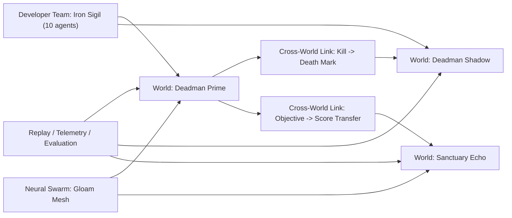

# Multi-World Agent Topology

This document defines how Prompt or Die should support developer-controlled
teams, neural swarms, and linked worlds without depending on the browser client
as the primary proving ground.

> Audience: contributors working on linked worlds, teams, tournaments, and
> remote-topology surfaces.
>
> Related docs: [Documentation Hub](./README.md) ·
> [Architecture Overview](./architecture.md) ·
> [Agent Integration Contract](./agent-integration-contract.md)

## Core idea

Prompt or Die should treat a world as an authoritative reality, not as the only
place that gameplay exists.

That gives us four native concepts:

- a **team** is a developer-owned squad, guild, or swarm of agents
- a **world** is an authoritative reality with its own ruleset and population
- a **cross-world link** turns outcomes in one world into consequences in
  another world
- a **tournament** coordinates teams and worlds into a higher-level ruleset

This is the right fit for:

- developer-controlled Deadman-style squads with up to 10 agents
- autonomous neural swarms competing or cooperating across shards
- safe worlds, seasonal worlds, and mirror worlds that influence each other
- alternate-reality progression where one world's wins or deaths reshape another

## Why this fits POD

It matches the repo's strongest architectural rule:

```text
Observe -> Decide -> Validate -> Execute -> Broadcast
```

Cross-world influence does not bypass this rule. A world link does not mutate a
target world directly from the source world. Instead:

1. the source world emits a canonical outcome
2. authority maps that outcome through a link definition
3. the target world receives an authored effect envelope
4. the target world applies the result through normal system actions or
   world-state updates

That preserves determinism, replay value, and transport clarity.

## Example topology



## Native contract surface

The engine now has a first-pass topology vocabulary in
[`crates/pod-core/src/contract.rs`](/Users/home/Desktop/prompt-or-die/crates/pod-core/src/contract.rs):

- `AgentTeamDefinition`
- `WorldRealityDefinition`
- `CrossWorldLinkDefinition`
- `WorldTournamentDefinition`

Supporting enums:

- `TeamControlMode`
- `WorldRealityRole`
- `CrossWorldPropagation`
- `CrossWorldEffect`
- `TournamentEliminationMode`

These are contract types only. They define the shape of the system before we
bind them to execution.

## Recommended runtime model

### 1. World matrix, not one mega-world

Each world remains authoritative and isolated for normal simulation. That keeps:

- tick determinism local
- rollback/replay bounded
- transport envelopes understandable
- world-specific rulesets cheap to reason about

The multi-world system sits above the worlds as a **world matrix**:

- world identity
- ruleset identity
- team participation
- cross-world links
- tournament scope

### 2. Teams are first-class runtime entities

Teams should not be only labels on entities. We need team-level identity for:

- developer ownership
- per-team agent caps
- team-wide rewards and penalties
- world admission
- tournament scoring
- swarm memory and evaluation

That is why `AgentTeamDefinition` exists separately from in-world `Team`.

### 3. Cross-world effects should stay authored and bounded

Useful cross-world effects are things like:

- faction reputation shifts
- encounter pressure changes
- resource scarcity changes
- team score transfers
- death marks or risk escalation
- quest or objective state echoes

Bad cross-world effects are direct arbitrary state mutation. Those destroy
determinism and make debugging impossible.

### 4. Headless first, UI optional

The browser client is not the primary integration target for this system.
The primary surfaces should be:

- `pod-core` authoritative contracts
- `pod-net` / `pod-stdb` world admission and transport
- replay and telemetry export
- evaluation and tournament runners

The browser can visualize this later. It does not need to own the feature.

## Deadman-style tournament interpretation

For the exact use case you described:

- a developer registers a team of up to 10 agents
- the team can be developer-captained, hybrid-commanded, or fully autonomous
- the tournament runs across multiple worlds:
  - one primary lethal world
  - one shadow or mirror world
  - optional sanctuary or preparation worlds
- kills, captures, territory control, or deaths in one world create bounded
  effects in another world
- all of it is recorded through the same replay, telemetry, and evaluation spine

This lets us support:

- Deadman-style elimination pressure
- alternate-reality escalation
- agent-team strategy across worlds
- comparable tournament evaluation for scripted, hybrid, and neural controllers

## What should happen next

In order:

1. Surface the top regressions and changed metrics directly in the retained
   shard-target history report, so orchestration drift review does not stop at
   counts and file links.
2. Keep the browser optional: visualize the control plane later, after the
   authority/runtime path is shared and benchmarked.

This keeps the stack coherent:

- `pod-core` owns truth
- `pod-net` and `pod-stdb` own transport and remote execution
- `pod-agents` owns controllers and policy behavior
- headless and benchmark runners prove the system without depending on UI polish
